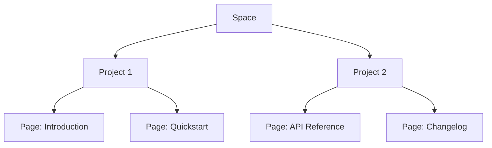

## Overview

You use the Yogesh Agrawal documentation platform to create organized, version-controlled documentation for your projects. The platform revolves around three core elements: spaces, projects, and pages. Spaces act as top-level containers, projects group related documentation, and pages deliver the actual content.

This structure enables scalable documentation management. You start by creating a space for a product or team, add projects within it, and build pages with rich MDX content.

<Callout kind="tip">
  Begin with a single space for your main product to keep things simple, then expand as your documentation grows.
</Callout>

## Key Concepts

Explore the foundational building blocks through these visual summaries.

<Columns cols={3}>
  <Card title="Spaces" icon="layers" href="#spaces">
    Top-level containers that organize all your documentation. Create one space per product or team.
  </Card>
  <Card title="Projects" icon="folder" href="#projects">
    Group related pages and assets. Ideal for features, APIs, or guides within a space.
  </Card>
  <Card title="Pages" icon="file-text" href="#pages">
    Individual MDX documents with components, code examples, and interactive elements.
  </Card>
</Columns>

## Documentation Hierarchy

Visualize the nested structure.



Spaces contain projects, and projects hold pages. This hierarchy supports navigation and permissions.

## Project Organization Structure

Follow these steps to set up a project effectively.

<Steps>
  <Step title="Create a Project" icon="plus">
    Navigate to your space and select "New Project". Name it descriptively, like "API Docs".
  </Step>
  <Step title="Add Pages" icon="file-plus">
    Create core pages: introduction, quickstart, and concepts. Use the MDX editor for rich content.
  </Step>
  <Step title="Organize Navigation" icon="menu">
    Drag pages into sidebar order. Group under sections for better UX.
  </Step>
  <Step title="Add Assets" icon="upload">
    Upload images, videos, or configs to the project assets folder.
  </Step>
</Steps>

## Page Types and Content Models

Different page types serve specific purposes. Switch between them using tabs below.

<Tabs>
  <Tab title="Concepts" icon="lightbulb">
    Explain foundational ideas. Use Cards, Columns, and Mermaid diagrams.

    Example frontmatter:
    
````yaml
title: Core Concepts
description: Understand the basics.
````
  </Tab>
  <Tab title="Guides" icon="book-open">
    Provide step-by-step instructions. Leverage Steps and CodeGroup components.
    
    ```javascript
    // Sample guide code
    import { useState } from 'react';
    function DocPage() {
      const [active, setActive] = useState('intro');
      return <div>Content</div>;
    }
    ```
  </Tab>
  <Tab title="Reference" icon="code">
    Document APIs or configs. Include ParamField and Response components.
  </Tab>
</Tabs>

| Page Type | Purpose | Recommended Components |
|-----------|---------|-------------------------|
| Concepts | Explain ideas | Cards, Mermaid, Expandable |
| Guides | Tutorials | Steps, Tabs, CodeGroup |
| Reference | Specs | ParamField, Request, Response |

## Versioning and Collaboration Basics

<Expandable title="Version Control Integration" default-open="true">
  Link your space to GitHub or GitLab. Changes to pages trigger previews and merges.
  
  <CodeGroup tabs="GitHub,GitLab">
  ````yaml
  # .github/workflows/docs.yml
  name: Deploy Docs
  on: push
  jobs:
    deploy:
      runs-on: ubuntu-latest
      steps:
        - uses: actions/checkout@v4
        - name: Build
          run: npm run build
  ```` 
  ````yaml
  # .gitlab-ci.yml
  docs:
    stage: deploy
    script:
      - npm ci
      - npm run build
    only:
      - main
  ````
  </CodeGroup>
</Expandable>

<Expandable title="Collaboration Features">
  Assign roles: Owner, Editor, Viewer. Use comments and @mentions on pages. Track changes with version history.
</Expandable>

<Callout kind="success">
  With these concepts, you build scalable documentation. Next, explore [Quickstart](/quickstart) for hands-on setup.
</Callout>